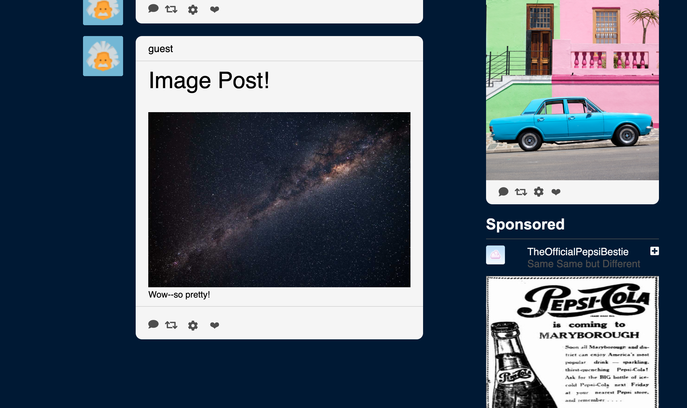
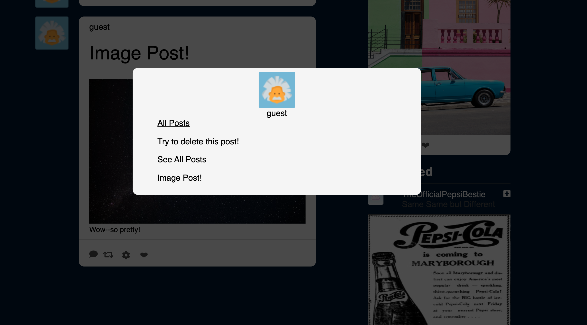
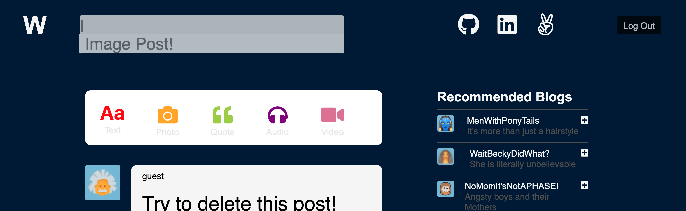
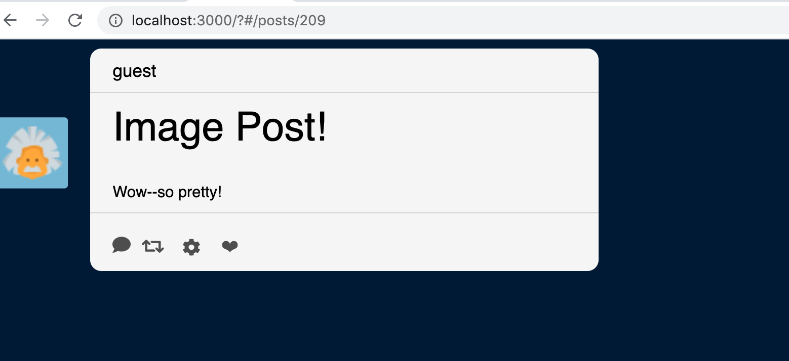
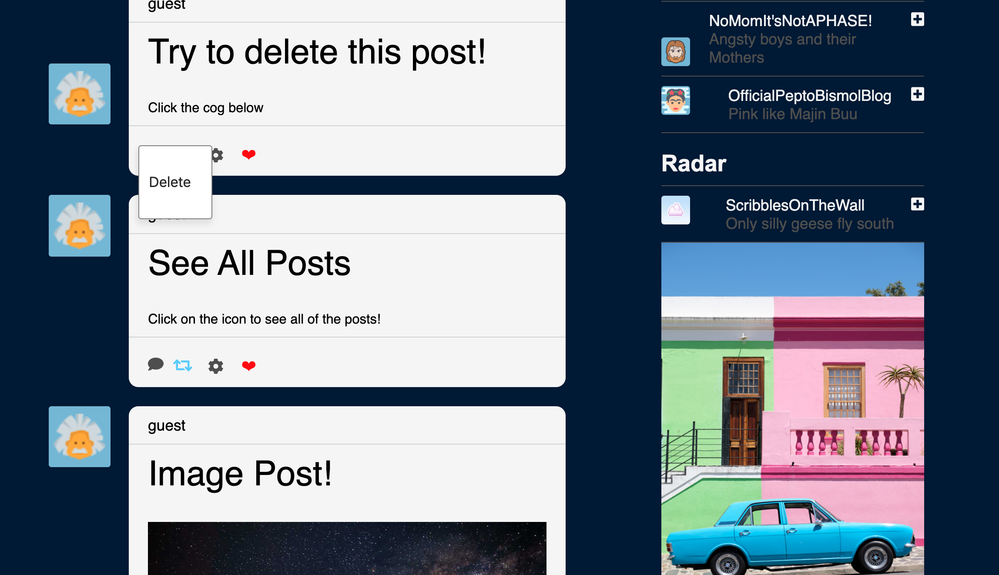

**Live Website**

Click Here to try out [Wander](https://wanderboy.herokuapp.com/#/login)

---

**Wander**


---

**Table of Contents**

Introduction

Features

Technologies

Todos

---

**Introduction**

Wander is a content-driven personal blog site, where sharing anything and everything is not only allowed but encouraged. Inspired by tumblr, Wander allows users to express themselves, connect with other likeminded users, whilst joining new communities. Once Wander has achieved fully operational status, it will be able to support a variety of media, meaning that posts can  be shared in countless different ways: varying from text, images, videos, quotes, and audio. However, at this stage, Wander only supports text posts. 

---

**Features**

---
Wander empowers its users with:

interactive and intuitive ways to create and share anything(literally anything)
ways to explore and expierence other individuals or communities
the ability to modify and curate their own pages


The crowning jewel of Wander is its 'post-index' page. This page can be thought of as a feed or dashboard. Once logged, either uniquely or through the built in 'guest login' functionality, the user live post. This was achieved chiefly through the post-index container where a modal and a series of actions built elsewhere were strategically fed into the 'post-index-item' page. This is a specific rendering page built to handle live posting. 


```const msp = (state) => {
    return {
        posts: Object.values(state.entities.posts),
        currentUser: state.entities.users[state.session.id]
    }
};

const mdp = (dispatch) => ({
    fetchAllPosts: () => dispatch(fetchAllPosts()),
    openTextPostForm: () => dispatch(openModal('text-post-form')),
    logout: () => dispatch(logout())
});
```
Wander empowers its users with:

Image posting. 




User homepage. 



Animated and fully functional search bar. 



Individual post page. 



Like, reblog, and delete functionality on each post 


Methods to create posts including animations were added to facilitate user experience


---
**Technologies**

Wander is created with:

Front-End: React/Redux

Back-End: Rails/PostgresSQL

Cloud Storage: AWS S3


---
**Todos**

implement 'follow' functionality that has already been built out in the backend

Create and implement a comment feature 
